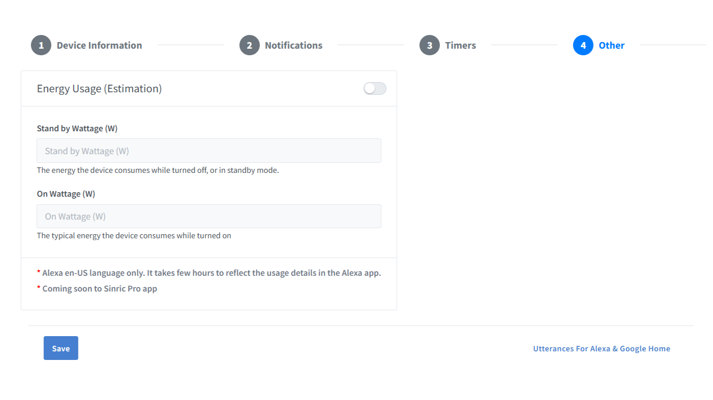
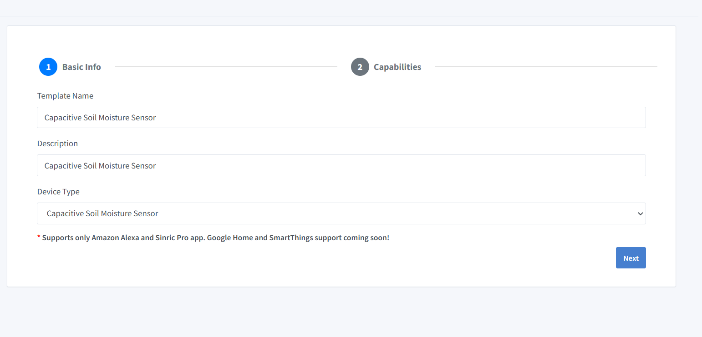
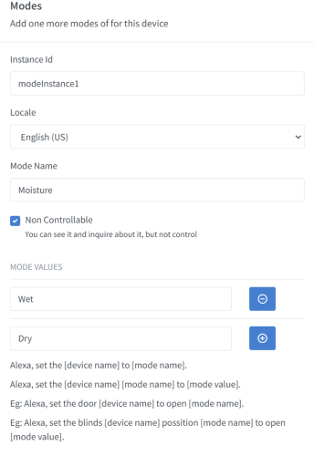
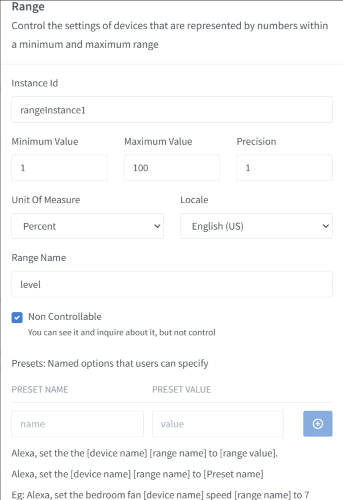
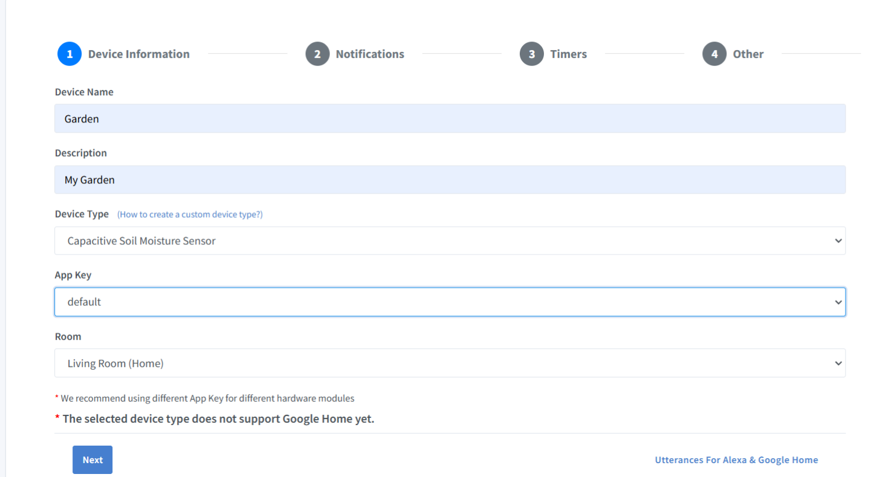
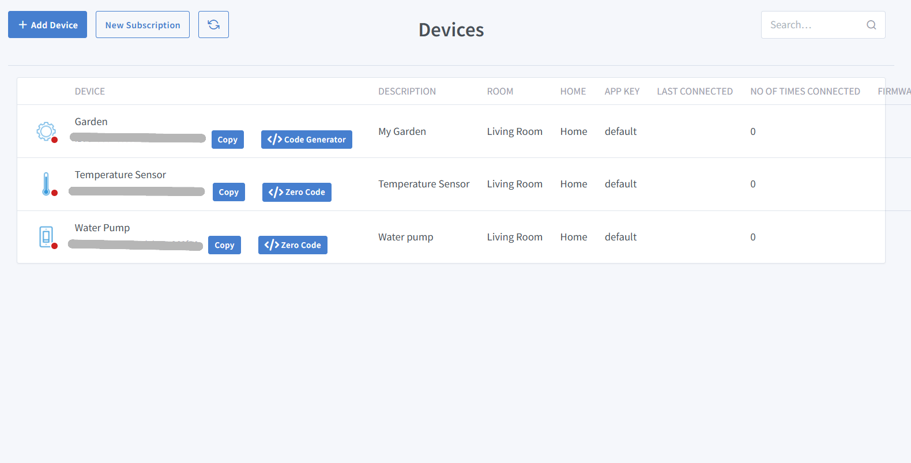

# SmartControl-with-Alexa
 
## Project Overview
SmartControl with Alexa is an innovative IoT project designed to provide hands-free control of devices through voice commands using Alexa. This project leverages an ESP32 Dev Module, a two-channel 10-amp relay module, a DHT11 sensor, and a resistive soil moisture sensor. By integrating these components with the Sinric Pro platform and fauxmoESP library, users can monitor environmental conditions and control devices such as water pumps through voice commands, the Alexa app, or the Sinric Pro app.

---

## Components Required

1. ESP32 Dev Module
2. Two-channel 10-amp relay module
3. DHT11 sensor (temperature and humidity)
4. Resistive soil moisture sensor
5. Jumper wires and breadboard
6. Power supply for ESP32 and relay module
7. Laptop or computer with Arduino IDE installed
8. Sinric Pro account and Alexa device/application

---

## Setup Steps for SmartControl with Alexa

### Step 1: Install Arduino IDE and Connect ESP32 Dev Module

#### 1. Install Arduino IDE
Download and install the Arduino IDE from the official website:  
[https://www.arduino.cc/en/software](https://www.arduino.cc/en/software)

#### 2. Add ESP32 Board Support
1. Open Arduino IDE and go to **File > Preferences**.  
2. In the "Additional Board Manager URLs" field, add the following:  
`https://raw.githubusercontent.com/espressif/arduino-esp32/gh-pages/package_esp32_index.json`
3. Click **OK**.  
4. Go to **Tools > Board > Boards Manager**, search for **ESP32**, and install the ESP32 package.

#### 3. Install USB-to-Serial Drivers (if needed)
If your ESP32 board doesn't connect automatically, install drivers for its USB chip:  
- **CP210x**: [Download from Silicon Labs](https://www.silabs.com/developers/usb-to-uart-bridge-vcp-drivers)  
- **CH340**: [Download from WCH](http://www.wch.cn/downloads/CH341SER_EXE.html)  
- Linux and newer macOS versions typically have these drivers pre-installed.

#### 4. Connect ESP32 to Computer
Use a USB cable to connect your ESP32 development board to your computer.

#### 5. Configure Arduino IDE
1. Go to **Tools > Board** and select **ESP32 Dev Module**.  
2. Go to **Tools > Port** and select the port to which the ESP32 is connected.  

You’re now ready to upload code to your ESP32!

---

### Step 2: Extract Code from GitHub

1. Visit the GitHub repository containing the project code (provide the GitHub link here).
2. Download the repository as a ZIP file or clone it using:  
   `git clone <repository-link>`
3. Extract the ZIP file (if downloaded) and open the `.ino` file in Arduino IDE.

---

### Step 3: Sign Up on Sinric Pro and Create Devices

1. **Sign Up and Create an Account**  
   Go to [https://sinric.pro/](https://sinric.pro/) and create a free account by signing up with your email.  

2. **Add a New Device for Water Pump**  
   - Click on **Add a New Device** in the dashboard.  
     
   - Provide a **Device Name** (e.g. *Water Pump*), **Description** (e.g. *Water Pump*), and select the **Device Type** as **Switch**.  
     
   - Go to the **Other** option in the top right corner and click **Save**.  
        
   - Note down the **Device ID**, **App Key**, and **App Secret** (confidential information).  
     

3. **Add a Device for Temperature and Humidity Sensor (DHT11)**  
   - Navigate to the **Devices** menu below the dashboard and click on **Add Device**. 
   - [Img3.5](Images/Img3.5.png)
   - Fill in the **Device Name** (e.g., *Temperature Sensor*) and **Description** (e.g., *Temperature Sensor*).  
   - Select **Temperature Sensor** as the **Device Type** from the drop-down menu.  
       
   - Go to the **Other** option and click **Save**.  

4. **Create a Custom Device Type for Soil Moisture Sensor**  
   - Since there is no built-in type for Soil Moisture Sensor in Sinric Pro, you need to create a custom device type.  
   - Go to **Create Template** and fill in the required details.  
     - Set **Device Type** to **Capacitive Soil Moisture Sensor**.  
         
   - Add **Mode** and **Range Capabilities** to the device:  
       
     - Configure these fields according to the details provided in the following images:  
       
       
 
   - Click **Save** to finalize the template.  

5. **Add a Device for Soil Moisture Sensor**  
   - After creating the template, add a new device and select **Capacitive Soil Moisture Sensor** as the **Device Type**.  
   - Provide a **Device Name** (e.g., *Soil Moisture Sensor*), **Description**, and click **Save**.  
       

6. **Note the Device IDs and Credentials**  
   - Note down the **Device IDs** for each device created. 
    
       
   - The **App Key** and **App Secret** will remain the same for all devices.  

Once all devices are created, you are ready to proceed to the next step of integrating them with your ESP32 project.

---

### Step 4: Configure the Code

1. Open the code extracted from GitHub in Arduino IDE.
2. Replace the placeholders with:
   - Your Sinric Pro API Key , APP Secret and Device IDs.
   - Your Wi-Fi SSID and password.
   - All these needs to be placed in credentials.h file.

---

### Step 5: Assemble the Circuit

1. Refer to the circuit diagram (attach or provide a detailed description).
2. Connect the DHT11 sensor, soil moisture sensor, and relay module to the ESP32 as per the diagram.
3. Ensure proper power connections to all components.

---

### Step 6: Upload the Final Code

1. Connect the ESP32 to your computer.
2. In Arduino IDE, verify the code by clicking on the **Verify** button.
3. Click **Upload** to flash the code onto the ESP32.
4. To upload code to an ESP32, it needs to be in "flashing mode" or "bootloader mode" which is usually
   achieved by holding down the "BOOT" button on the board while initiating the upload process.

---

### Configuring the Alexa Application

1. **Enable Sinric Pro Skill**  
   Open the **Skills & Games** section in the Alexa app and search for the **Sinric Pro Skill**.  
   Enable it by signing in with the same account used for your Sinric Pro configuration.  
     
   Once linked successfully, you will see a confirmation message.  
   

2. **Device Discovery**  
   After linking Sinric Pro, click on **Next**, and Alexa will automatically detect the three devices that were configured.  
   
   

3. **Configuring the Bulb Using FauxmoESP**  
   To configure the bulb, click on **Add Device** and select the **Other** option at the bottom of the list.  
   

4. **Selecting the Wi-Fi Option**  
   Choose the **Wi-Fi** option to continue the setup.  
   

5. **Automatic Bulb Connection**  
   The bulb will connect automatically.  
   Ensure that the ESP setup is active before connecting the bulb through FauxmoESP.
---

### Step 8: Control Devices

Once everything is set up, the devices connected to Sinric Pro and fauxmoESP can be controlled using:
- The Sinric Pro application.
- The Sinric Pro Web portal.
- The Alexa application.
- Alexa-enabled devices through voice commands.

---

Enjoy the convenience of voice-controlled automation with SmartControl with Alexa!
